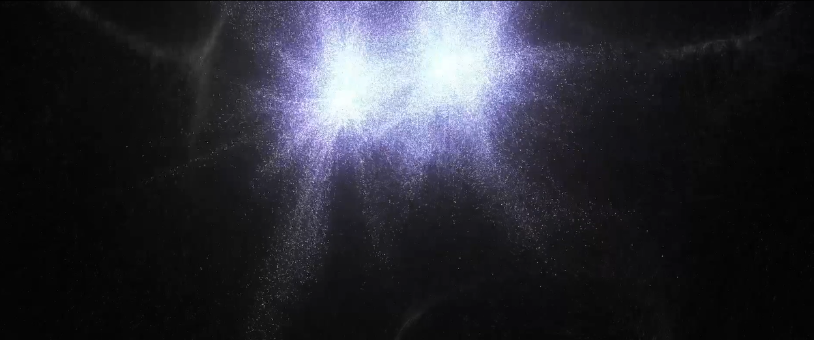
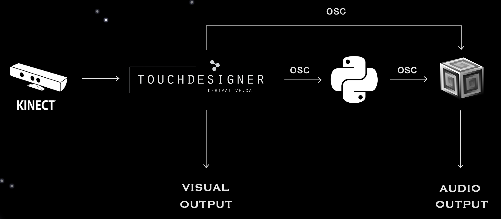
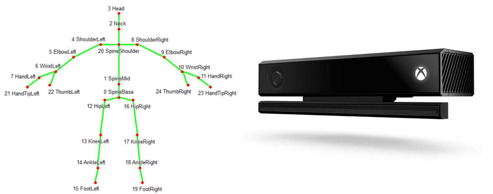
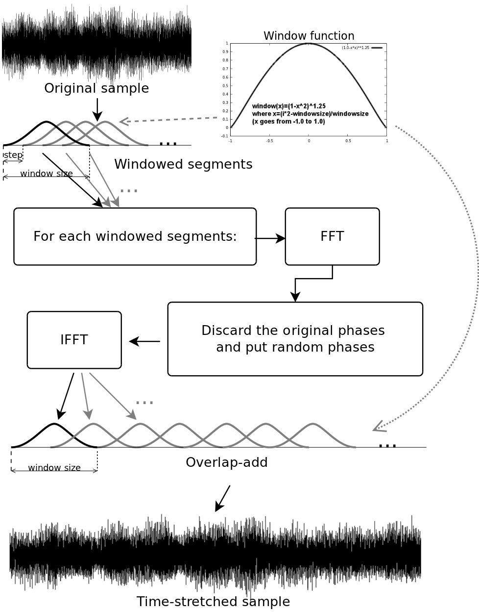
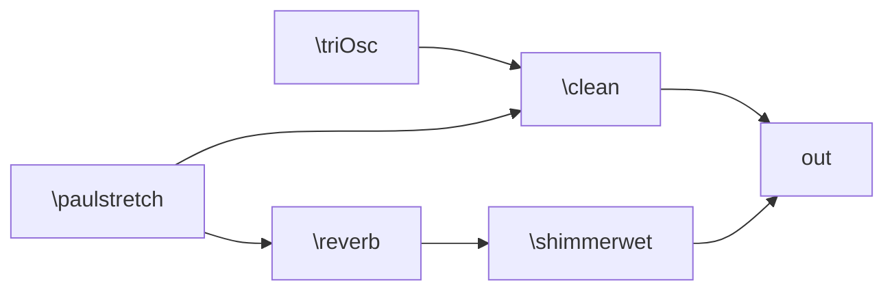
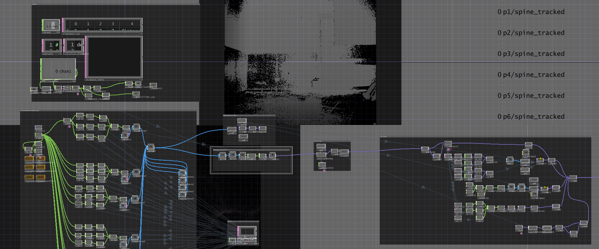

# χαρμολύπη (Charmolypi)

##
### Abstract
***χαρμολύπη*** is an interactive artistic experience aiming to explore the *beauty of closeness* in the context of human relationships. 

The loss of social connection often leads to feeling lonely and pained. Relationships are the expression of the choice to risk start losing something personal in exchange for making space for something enriching. 

Distance is hereby understood as solitude: individuals are self-contained beings when apart but when they choose to start getting closer to one another, an exchange gradually happens. This exchange will inevitably translate into the opening of their respective boundaries, sharing parts of themselves to receive something valuable in exchange. 

The intention behind this project is to explore and abstractly represent what humans possess and can choose to share of themselves, enhancing the value of the enriching effect closeness in relationships has on the individual. 
## 

## Table of Contents
- [Abstract](#abstract)
- [Table of Contents](#table-of-contents)
- [Final Purpose and Achievement](#final-purpose-and-achievement)
- [Links](#links)
- [Flowchart and Technical Summary](#flowchart-and-technical-summary)
  - [Sensor - Kinect V2](#sensor---kinect-v2)
  - [Variable Length Markov Model - Python](#variable-length-markov-model---python)
  - [Sound Synthesis - Supercollider](#sound-synthesis---supercollider)
  - [Visualization - Touchdesigner](#visualization---touchdesigner)
  - [Hardware and Software List](#hardware-and-software-list)
  - [External Resources](#external-resources)
  - [Dependencies](#dependencies)
- [Final Considerations](#final-considerations)
  - [Known Issues](#known-issues)
  - [Possible Improvements](#possible-improvements)
- [Run on your machine](#run-on-your-machine)
  - [Requirements](#requirements)
  - [How to](#how-to)
- [Bibliography](#bibliography)

##
### Final Purpose and Achievement

The **final purpose** of the installation is for the user to perceive *human connection* as something *empowering* and *valuable* and to highlight the joy that comes from choosing to transition from solitude to community. Closeness, sharing and openness are all choices that the installation wants to promote and encourage. 

To achieve this, the installation exploits human-to-human interaction and both visual and audio implementations dynamically evolve contributing to make the users perceive closeness and connection as something valuable and energising. 

##  
Final project for the '_Creative Programming and Computing_' course of MSc. in _Music and Acoustic Engineering @ Politecnico di Milano_ (a.y. 2023/2024) held by [Prof. Massimiliano Zanoni](http://www.massimilianozanoni.it). 

Developed by:

- [Emma Coletta](https://github.com/emmaclt)
- [Enrico Dalla Mora](https://github.com/EnricoDallaMora)
- [Federico Ferreri](https://github.com/federicoalferreri)
- [Lorenzo Previati](https://github.com/LorenzoPreviati22)

## Links
- [Hackathon Project Presentation](./assets/presentation/prototipo_cpac.pdf)
- [Final Project Presentation](assets/presentation/CPAC_CHARMOLYPI_group7.pptx)
- [🎞️Video Demo](https://youtu.be/q8xytoQ--RE?feature=shared)

<!--- [📄Report]()--->

## Flowchart and Technical Summary

<!---
-->

    

### Sensor - Kinect V2
The [Microsoft Kinect V2](https://en.wikipedia.org/wiki/Kinect) is a motion sensitive input device, capable of tracking the skeleton (i.e. the x, y and z positions of 24 joints) of up to six users. An infrared camera, along with an RGB one, allow the sensor to gather information both in good and poor lighting conditions, effectively allowing the installation to be set in a dark room.

    

##

### Variable Length Markov Model - Python
The python script is responsible of implementing a **Variable Length Markov Model** which constitutes the **generative music module** of the installation. Markov chains are stochastic transitional networks used to model sequences of discrete events. Computation is based on the conditional probability $P(x_t, x_{t−1}, ..., x_{t-n})$ where $n$ is defined as the **order** of the chain. All the states, transitions and relative probabilities can be gathered in a **transition probability matrix**.

    

In the context of this installation, a *variable length* markov model is implemented, meaning the matrix includes the transitional probabilities and states for all the orders up to the maximum. OSC messages sent from **TouchDesigner** will then set the order to be employed according to the calculated distance between users. Players being close together will result in an higher order of the chain i.e. in a more coherent and harmonic music generation. Conversely, when the users are far apart the music will be more stochastic.

The file [my_chain.py](./my_chain.py) implements the `VariableLengthMarkovChain` class with its relative methods for building the model and computing the transitional matrix - `_build_transitions()` - as well as one for generating an original sequence starting from an initial sequence - `generate(self, state, set_order)`. More specifically, the probabilty matrix is built using a **dictionary inside dictionary architecture**: the first key is the current state to which another dictionary is linked. The second dictionary has the possible outcome as key and the probability (integer number) as the linked value. Successively, the `generate` method will check if the current **tuple**, which length is set to be equal to the `set_order` in the [play.py](./play.py) file, has transitional probabilities or has never been encountered in the dataset, therefore having no possible outcomes. If, for the current order, the tuple has no probabilities, a control sequence will lower the order and the tuple length accordingly, effectively increasing the probability of the tuple being encountered in the dataset. Ultimately, when the order of the chain reaches one, an outcome is granted to be generated.

The file [play.py](./play.py) is responsible of setting up the OSC communication with **TouchDesigner** and **SuperCollider**, manipulating the initial dataset and actually generating the notes informations to be sent to the sound synthesis module. The python library `mido` translates MIDI files information from the [MAESTRO-v3.0.0 dataset](https://magenta.tensorflow.org/datasets/maestro#v300) into a list of strings featuring the following informations: [MidiNoteNumber, velocity, time]. From here on, the extracted values are converted to numbers and processed, in order to compute the `dur` parameter accounting for the duration of the notes. Despite the size of the dataset, the probability of encountering a tuple containing a number `set_order` of strings of the type:`[0-127] [0-127] [undefined range of milliseconds] [undefined range of milliseconds]` mostly results to be 1, meaning the tuple is encountered only once in the dataset and has only one possible outcome. This will result in the generation becoming deterministic. In order to avoid this case, velocity, time and duration values are quantized to a smaller set of values taken around the center of the gaussian probability distribution of the values themselves. After both the model and sequences have been generated, the values are converted back to the original range. This computation, performed by the `transform_and_quantize` and `inverse_transform` methods, effectively improves the non-deterministic behavior of the model. Once the notes have been generated in real-time by an infinite *while* loop delayed by the `time` value, musical information is sent to **SuperCollider** via OSC.

##
### Sound Synthesis - Supercollider

SuperCollider receives OSC messages from both **TouchDesigner** and **Python**: the first ones contain information on synthesis parameters like cutoff frequencies or amplitude of synths, the latter notes velocity and duration.
In the first section of the SC script, two synths are defined: `\triOSc` and `\paulstretchMono`. The first one generates simple sinusoids responsible of giving a clear and intelligible sound, the latter implements the [paulstretch algorithm](https://hypermammut.sourceforge.net/paulstretch/) which, by migrating to the frequency domain using `stft`, slows down a given sample by huge amounts (50000:1 in this case).

    

The sample being used is [string1.wav](./string11.wav), a short and rich-in-harmonics sample from a synthesized guitar string. The signal will undergo various effects eventually resulting in an abstract and aerial sound. The sound signal path is schematized in the following synthesis chain:

Other elements contributing to sound synthesis are the `\reverb` synthDef, implementing a shimmer reverb which pitch-shifts and adds reverb to the signal, as well as `\shimmerwet`, featuring a feedback loop in which the signal is distorted and reverbed again. Finally, the `\clean` synthDef performs routing operation to output the two synths. 

OSC data from **Python** instantiates the various synths then freed once their envelope comes to an end. To reflect users' behavior, data coming from **TouchDesigner** manages the tuning of a set of parameters for synths and effects, in order to achieve final perception of dynamical change. 
##
### Visualization - TouchDesigner

    

The Touchdesigner network is divided into several groups of nodes:
- `Geometry generation for spawning particles`: this network retrieves the player position data and nomalizes it with respect to the maximum and minimum value reached among users. This translates in the ability of the audio-visual system to auto-calibrate itself regardless of the room dimensions in which the installation is taking place. The max and min values for the x, y and z coordinates are retrieved in the `MIN_MAX` subnetwork by employing a DAT module which implements a Python script. The channel values extracted from the `Kinect CHOP`are then converted to spheres by means of surface operators - `SOPs` - which are bypassed accordingly to the kinect detecting the users or not. 
- `SOP-Top data for particle source`:
These geometries are affected by a 3D noise with the `Noise SOP`: the noise amplitude is controlled by the `closeness` parameter which will be later discussed. Later on, the geometries are converted to `TOPs` so that they can be fed to the `ParticlesGPU` module.
- `Particle system`:
The `ParticlesGPU` module implements a `GLSL` script which instantiates particles with given geometries (squares) spawning according to the users position. The lifespan of the particles is very short in order to follow the player's movement. Turbulent forces contribute to the sense of movement by randomly displacing particles. A bloom effect is then added to enhance the visual result. Furthermore, another pointcloud in the background contributes to giving a sense of space.
- `Closeness`: the `calculate_distances DAT` is responsible of computing all possible distances between active players. These distances will then be averaged and ranged in order to get the `closeness` parameter. This value will be sent via OSC messages both to **Python** and **SuperCollider** to set the order of the Varibale Length Markov Chain and the previously mentioned parameters used to model sound synthesis. 

##

### Hardware and Software List

Our testing and development setup involved:
- [Xbox Kinect Technology](https://en.wikipedia.org/wiki/Kinect)
  - motion and distance detection 
- [TouchDesigner by Derivative.ca](https://derivative.ca)
  - motion and distance mapping
  - visual and graphics
- [Python](https://www.python.org/downloads/)
  - variable markov chain algorithm implementation
  - music sequence generation and composition
- [SuperCollider](https://supercollider.github.io)
  - sound synthesis
  - audio output
- [OSC - Open Sound Control](https://opensoundcontrol.stanford.edu/index.html)
  - networking and communication protocol

### External Resources
- [MAESTRO-v3.0.0 dataset](https://magenta.tensorflow.org/datasets/maestro#v300) [^1] by [Magenta](https://github.com/magenta/magenta)
  - midi files used to generate music sequences
<!--- [Markov Chain?]()-->

### Dependencies 
- Python
  - [Mido - MIDI Objects for Python](https://github.com/mido/mido)
  - [pyOSC3](https://github.com/Qirky/pyOSC3.git)

## Final Considerations
### Known Issues
- Deprecated Kinect SDK (continuity issues)
- Deterministic component of the sequence generation using the Variable Length Markov Chain [solved]
- People on the background lightly interfere with overall functioning of the sensor 

### Possible Improvements
- Include extra features to further model the system evolution in time (e.g. use of Twitter's API in order to evaluate density of specific words to affect the probabilities used in music sequence generation)

## Run on your machine

### Requirements
- Hardware
  - Microsoft Kinect V2
- Software:
  - TouchDesigner: [download](https://derivative.ca/download)
  - Python: [download](https://www.python.org/downloads/)
  - SuperCollider: [download](https://supercollider.github.io/downloads)
  - Python Dependencies

### How to
1. Get yourself a Kinect motion sensor and install the SDK [download](https://www.microsoft.com/en-us/download/details.aspx?id=44561)
2. Make sure you have all software requirements mentioned above installed
3. Set up your hardware and software (TouchDesigner) communication
4. Run [play.py](./play.py)
5. Execute [sound.scd](./sound.scd)
7. Everything should be up and running now! Have fun playing around with the installation and seeing how both visual and audio dynamically evolve accordingly to the interaction happening between you and other user(s).
---
### Bibliography
[^1]: Curtis Hawthorne, Andriy Stasyuk, Adam Roberts, Ian Simon, Cheng-Zhi Anna Huang,
  Sander Dieleman, Erich Elsen, Jesse Engel, and Douglas Eck. "Enabling
  Factorized Piano Music Modeling and Generation with the MAESTRO Dataset."
  In International Conference on Learning Representations, 2019.

