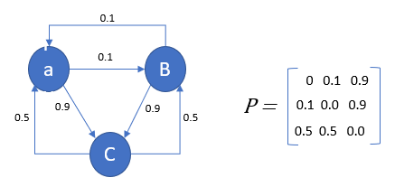

# χαρμολύπη (Charmolypi)
### Abstract
***χαρμολύπη*** is an interactive artistic experience aiming to explore the *beauty of closeness* in the context of human relationships. 

The loss of social connection often leads to feeling lonely and pained. Relationships are the expression of the choice to risk start losing something personal in exchange for making space for something enriching. 

Distance is hereby understood as solitude: individuals are self-contained beings when apart but when they choose to start getting closer to one another, an exchange gradually happens. This exchange will inevitably translate into the opening of their respective boundaries, sharing parts of themselves to receive something valuable in exchange. 

The intention behind this project is to explore and abractly represent what humans possess and can choose to share of themselves, enhancing the value of the enriching effect closeness in relationships has on the individual. 
## 

## Table of Contents
- [Abstract](#abstract)
- [Table of Contents](#table-of-contents)
- [Final Purpose and Achievement](#final-purpose-and-achievement)
- [Links](#links)
- [Flowchart and Technical Summary](#flowchart-and-technical-summary)
  - [Sensor - Kinect V2](#sensor---kinect-v2)
  - [Variable Length Markov Model - Python](#variable-length-markov-model---python)
  - [Sound Synthesis - Supercollider](#sound-synthesis---supercollider)
  - [Visualization - Touchdesigner](#visualization---touchdesigner)
  - [Hardware and Software List](#hardware-and-software-list)
  - [External Resources](#external-resources)
  - [Dependencies](#dependencies)
- [Final Considerations](#final-considerations)
  - [Known Issues](#known-issues)
  - [Possible Improvements](#possible-improvements)
- [Run on your machine](#run-on-your-machine)
  - [Requirements](#requirements)
  - [How to](#how-to)
- [Bibliography](#bibliography)

##
### Final Purpose and Achievement

The **final purpose** of the installation is for the user to perceive *human connection* as something *empowering* and *valuable* and to highlight the joy that comes from choosing to transition from solitude to community. Closeness, sharing and openness are all choices that the installation wants to promote and encourage. 

To achieve this, the installation exploits human-to-human interaction and both visual and audio implementations dynamically evolve contributing to make the users perceive closeness and connection as something valuable and energising 


##  
Final project for the '_Creative Programming and Computing_' course of MSc. in _Music and Acoustic Engineering @ Politecnico di Milano_ (a.y. 2023/2024) held by [Prof. Massimiliano Zanoni](http://www.massimilianozanoni.it). 

Developed by:

- [Emma Coletta](https://github.com/emmaclt)
- [Enrico Dalla Mora](https://github.com/EnricoDallaMora)
- [Federico Ferreri](https://github.com/federicoalferreri)
- [Lorenzo Previati](https://github.com/LorenzoPreviati22)

## Links
- [Project Proposal Presentation](./assets/presentation/prototipo_cpac.pdf)
- [Final Project Presentation]()
- [📄Report]()
- [🎞️Video Demo]()

## Flowchart and Technical Summary
<!--


-->


### Sensor - Kinect V2
The [Microsoft Kinect V2](https://en.wikipedia.org/wiki/Kinect) is a motion sensitive input device, capable of tracking the skeleton - i.e. the x, y and z positions of 24 joints - of up to six users. An infrared camera, together with an RGB one, allow the sensor to gather these informations even with poor lighting conditions, effectively allowing the installation to be set in a dark room.


##
### Variable Length Markov Model - Python
The python script is responsible of implementing a **variable length markov model** which constitutes the **generative music module** of the installation. Markov chains are stochastic transitional networks which are
used to model sequence of discrete events. It is based on the conditional probability $P(x_t, x_{t−1}, ..., x_{t-n})$ where $n$ is defined as the **order** of the chain. All the states, transitions and relative probabilities can be gathered in a **transition probability matrix**.



In the context of this installation, a variable length markov model is implemented, meaning the matrix includes the transitional probabilities and states for all the orders up to the maximum. OSC messages being received from **Touchdesigner** will then set the order to be employed according to tha calculated distance between users. Players being close together will result in an higher order of the chain i.e. in a more coherent and harmonic music generation. Conversely, when the users are far apart the music will be more stochastic.

The file [my_chain.py](./my_chain.py) implements the `VariableLengthMarkovChain` class with its relative methods for building the model and computing the transitional matrix - `_build_transitions()` - and for generating an original sequence starting from an initial sequence - `generate(self, state, set_order)`. In particular, the probabilty matrix is built using a **dictionary inside dictionary architecture**: the first key is the current state to which another dictionary is linked. The second dictionary has the possible outcome as key and the probability (integer number) as the linked value. Successively, the `generate` method will check if the current **tuple**, which length is set to be equal to the `set_order` in the [play.py](./play.py) file, has transitional probabilities or have never been encountered in the dataset therefore having no possible outcomes. If, for the current order, the tuple has no probabilities, a control sequence will lower the order and accordingly the tuple length, effectively highering the probability of the tuple being encountered in the dataset. Ultimately, when the order reaches one, an outcome is garanted to be generated.

The file [play.py](./play.py) is resposible of setting up the OSC communication with **Touchdesigner** and **Supercollider**, manipulating the starting dataset and actually generating the notes informations to be sent to the sound synthesis module. The python library `mido` translated MIDI files informations from the [MAESTRO-v3.0.0 dataset](https://magenta.tensorflow.org/datasets/maestro#v300) into a list of strings containing the following informations: [MidiNoteNumber, velocity, time]. From here on these informations are converted to numbers and processed in order to extract the `dur` parameter accounting for the duration of the notes. Despite the big size of the dataset, the probability of encountering a tuple of number `set_order` of strings of the type:`0-127 0-127 undefined range of milliseconds undefined range of milliseconds` mostly result to be 1. This means the tuple is encountered only once in the dataset and has only one possible outcome. This will result in the generation becoming deterministic. In order to avoid this condition, velocity, time and duration are quantized to a smaller set of values, which are taken around the center of a gaussian probability distribution of the values themselves. After the generation the values are converted back to the original range. This process, operated by the `transform_and_quantize` and `inverse_transform` methods effectively improves the non-deterministic behaviour of the model. Once the notes are generated in real-time by an infinite while loop delayed by the `time` value, the musical informations are sent to **Supercollider** via OSC.

##
### Sound Synthesis - Supercollider
Supercollider receives OSC messages both from **Touchdesigner** and **Python**, the first ones containing information on synthesis parameters like cutoff frequencies or amplitude of synths while the latter notes velocity and duration.
In the first section two synths are defined: `\triOSc` and `\paulstretchMono`. The first one is simple sinusoids responsible of giving a clear and intelligible sound. The latter implements the [paulstretch algorithm](https://hypermammut.sourceforge.net/paulstretch/) which, by opertating in the frequency domain by employing the `stft`, slows by huge amounts (50000:1 in this case) a given sample.


 The sample being used is [string1.wav](./string11.wav), a short and rich-in-harmonics sample from a synthetized guitar string. This synth will undergoe various effect wich will result in an abstract and aerial sound. The sound signal path is schematized in the following synthesis chain:

```mermaid
graph LR
A[\triOsc] -->B[\clean]-->C[out]
D[\paulstretch] -->E[\reverb]-->F[\shimmerwet]-->C
D-->B
```

The `\reverb` synthDef implements a shimmer reverb which pitch-shifts the signal and add reverb to it, while `\shimmerwet` operates a feedback loop in which the signal is distorted and reverbed again. Finally the `\clean` synthDef is only responsible of routing the two synths to the output. OSC data from **Python** instantiates the various synths which will be freed from computing once their envelope is finished. The data coming from **Python**, on the other hand, tunes a set of parameters from the effects and the synths in order to provide a sense of dynamical change which reflects the users behaviour.
##
### Visualization - Touchdesigner

##

### Hardware and Software List

Our testing and development setup involved:
- [Xbox Kinect Technology](https://en.wikipedia.org/wiki/Kinect)
  - motion and distance detection 
- [TouchDesigner by Derivative.ca](https://derivative.ca)
  - motion and distance mapping
  - visual and graphics
- [Python](https://www.python.org/downloads/)
  - variable markov chain algorithm implementation
  - music sequence generation and composition
- [SuperCollider](https://supercollider.github.io)
  - sound synthesis
  - audio output
- [Open Sound Control](https://opensoundcontrol.stanford.edu/index.html)
  - networking and communication protocol

### External Resources
- [MAESTRO-v3.0.0 dataset](https://magenta.tensorflow.org/datasets/maestro#v300) [^1] by [Magenta](https://github.com/magenta/magenta)
  - midi files used to generate music sequences
<!--- [Markov Chain?]()-->

### Dependencies 
- Python
  - [Mido - MIDI Objects for Python](https://github.com/mido/mido)
  - [pyOSC3](https://github.com/Qirky/pyOSC3.git)

## Final Considerations
### Known Issues

### Possible Improvements

## Run on your machine

### Requirements
- Hardware
  - Microsoft Kinect V2
- Software:
  - TouchDesigner: [download](https://derivative.ca/download)
  - Python: [download](https://www.python.org/downloads/)
  - SuperCollider: [download](https://supercollider.github.io/downloads)
  - Python Dependencies

### How to
1. Get yourself a Kinect motion sensor and install the SDK [download](https://www.microsoft.com/en-us/download/details.aspx?id=44561)
2. Make sure you have all software requirements mentioned above installed
3. Set up your hardware and software (TouchDesigner) communication
4. Run [play.py](./play.py)
5. Execute [sound.scd](./sound.scd)
7. Everything should be up and running now! Have fun playing around with the installation and seeing how both visual and audio dynamically evolve accordingly to the interaction happening between you and other user(s).
---
### Bibliography
[^1]: Curtis Hawthorne, Andriy Stasyuk, Adam Roberts, Ian Simon, Cheng-Zhi Anna Huang,
  Sander Dieleman, Erich Elsen, Jesse Engel, and Douglas Eck. "Enabling
  Factorized Piano Music Modeling and Generation with the MAESTRO Dataset."
  In International Conference on Learning Representations, 2019.


